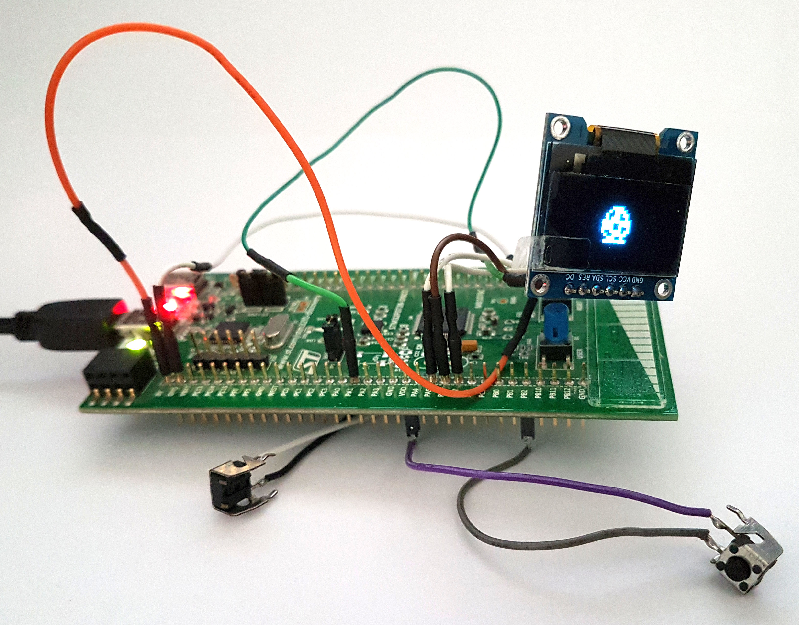

# MCUGotchi - A Tamagotchi P1 emulator for microcontrollers


## Synopsis

MCUGotchi is a Tamagotchi P1 emulator for microcontrollers relying on the hardware agnostic Tamagotchi P1 emulation library [TamaLIB](https://github.com/jcrona/tamalib/).



For the time being, MCUGotchi supports the STM32F0 MCU from STMicroelectronics, more precisely the STM32F072 discovery board, and the OpenTama board based on a STM32L072, with either an SPI SSD1306 OLED screen or an SPI UC1701x LCD screen connected to it, but it can basically run on any STM32F0/STM32L0 based board almost out of the box, and on any STM32 MCU with some modifications.

For the STM32F072 discovery board, the expected connections are the following:
| Name            | PIN     |
|-----------------|---------|
| SSD1306 CLK PIN | PA5     |
| SSD1306 DIN PIN | PA7     |
| SSD1306 DC PIN  | PA1     |
| SSD1306 CE PIN  | PA2     |
| SSD1306 RES PIN | PA6     |
| SSD1306 VCC PIN | VDD     |
| SSD1306 GND PIN | GND     |
| Left Button     | PB3/VDD |
| Middle Button   | PA0/VDD |
| Right Button    | PB2/VDD |

MCUGotchi is also a good example of an embedded implementation of TamaLIB's abstraction layer.

## Build instructions

MCUGotchi depends on several components:
* the __GNU ARM Embedded Toolchain__, which can be downloaded [there](https://developer.arm.com/tools-and-software/open-source-software/developer-tools/gnu-toolchain/gnu-rm/downloads)
* __OpenOCD__, if you want to use ST-Link to flash your board, which can be installed using the package manager of your operating system, or built using a release package provided [there](https://sourceforge.net/projects/openocd/)
* __dfu-util__, if you want to use the embedded DFU compliant bootloader of your board, which can be built following the instructions provided [there](http://dfu-util.sourceforge.net/)
* the __STM32Cube Libraries__, which are provided as submodules
* __TamaLIB__, which is also provided as submodule
* a __Tamagotchi P1 ROM__, which can be downloaded from [there](https://www.planetemu.net/rom/mame-roms/tama) for instance
* __Optional:__ __TamaTool__ to convert the binary ROM into a __.h__ file, which can be downloaded or built from [there](https://github.com/jcrona/tamatool)


1. Clone __MCUGotchi__ and its submodules:
```
$ git clone --recursive https://github.com/jcrona/mcugotchi.git
```
2. Download/build/install the __toolchain__, __OpenOCD__ and __TamaTool__. OpenOCD and the toolchain are expected to be in the parent folder of MCUGotchi, but you can place them wherever you want and adjust the first lines of __mcugotchi/Makefile__ accordingly.
3. __Optional:__ Convert the ROM to __rom_data.h__ and place it in __mcugotchi/src__ (__ROM_BUILT_IN__ should be enabled in __mcugotchi/src/rom.c__):
```
$ tamatool -r rom.bin -H > mcugotchi/src/rom.h
```
4. Build MCUGotchi:
```
$ cd mcugotchi
$ make
```
5. Connect your board and program it:
```
$ make flash
```
6. Enable the USB Mode of MCUGotchi and transfer the ROM (it should be called __rom0.bin__).
7. Try to keep your Tamagotchi alive !


## License

MCUGotchi is distributed under the GPLv2 license. See the LICENSE file for more information.


## Hardware information

The Tamagotchi P1 is based on an E0C6S46 Epson MCU, and runs at 32,768 kHz. Its LCD is 32x16 B/W pixels, with 8 icons.
To my knowledge, the ROM available online has been extracted from a high-res picture of a die. The ROM mask was clear enough to be optically read. The pictures can be seen [there](https://siliconpr0n.org/map/bandai/tamagotchi-v1/) (thx asterick for the link !).  
I would love to see the same work done on a P2 and add support for it in TamaLIB/MCUGotchi !

__  
Copyright (C) 2022 Jean-Christophe Rona
